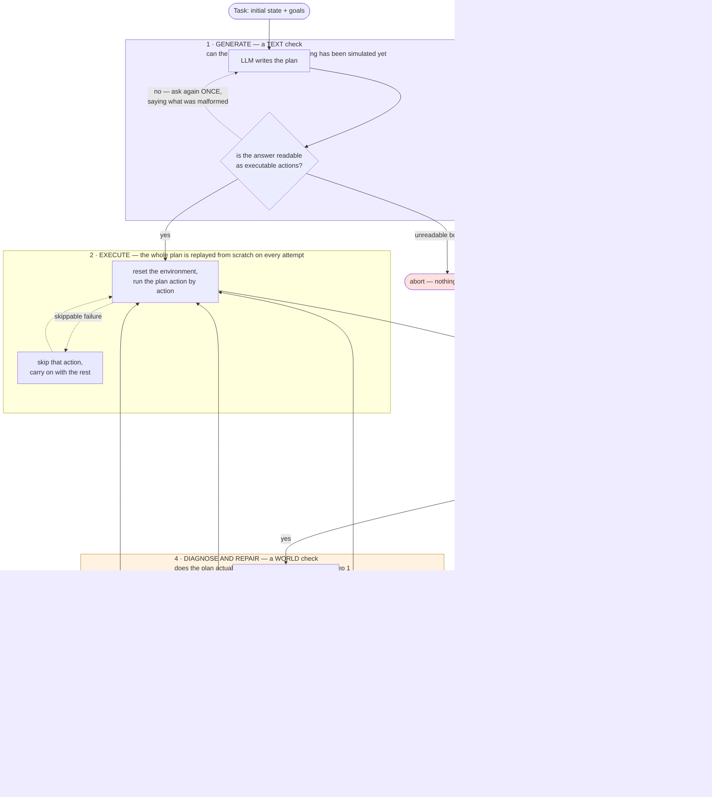
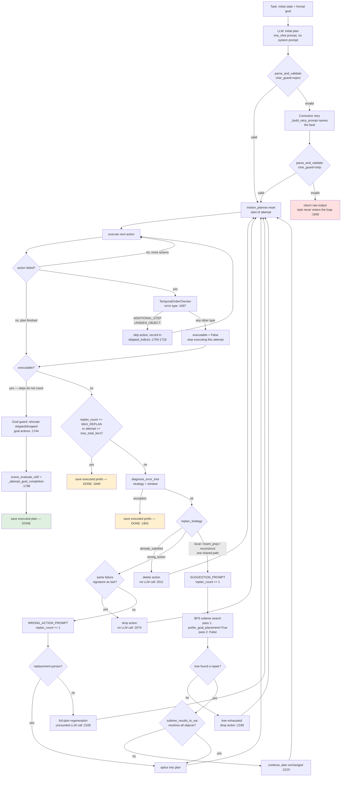

# Repair loop control flow

Two versions of the same thing. **Figure A** is for the chapter body — it is what a reader
needs in order to follow the method. **Figure B** is the complete branch-level reference,
with line numbers, for the appendix or for checking a claim. Both were verified against
`EAISDATreeRunner.run_single_task` in `eai_sda_runner_tree.py`.

---

## Figure A — the method (for the chapter body)

### Two different checks, easily confused

The figure contains two loops that both re-try something. They are unrelated:

| | **Generate** (top) | **Diagnose and repair** (bottom) |
|---|---|---|
| Question asked | Is the LLM's *text* readable as actions? | Does the plan *work* in the world? |
| When | Before anything is simulated | During simulation |
| Typical fault | `"LIE": []` — no object given; truncated JSON; the character used as an object | `GRAB` with both hands full; `OPEN` on a container that is switched on |
| Limit | 2 attempts, then abort the task | `MAX_REPLAN` LLM repair calls, plus an iteration cap |
| On giving up | Nothing executes at all | Whatever executed is saved |

The top loop fires when the model's answer cannot be converted into actions, so there is
nothing to execute and therefore nothing to diagnose. It is a format problem, not a planning
problem.

### The three things this figure is for

1. **Execution is a full replay, not a resume.** Every attempt calls
   `motion_planner.reset()` and re-runs the whole plan from the start. There is no reverse
   execution anywhere in the system — which is where the implementation departs from the
   paper (spec §9.10).
2. **Not every failure stops the plan.** A skippable failure is dropped and execution
   continues, so a plan can reach the success branch *having had failures*. That is exactly
   what the goal guard exists to repair.
3. **Diagnosis has three outcomes, and only two cost budget.** Dropping an action is free;
   the two LLM paths each charge one unit of `MAX_REPLAN`.

### What Figure A deliberately hides

All of these are in Figure B; state them if a reader asks.

- Three separate code paths converge on "drop the action": the action's effect is already
  true (`already_satisfied`), the same failure just repeated (`wrong_action` retry limit),
  and the search found nothing (`tree exhausted`).
- The tree search runs **twice** — once preferring to deliver a held object to its own goal
  destination, then once falling back to a plain `DROP`.
- Two rarer outcomes loop back with the plan **unchanged** rather than dropping anything:
  object-resolution failure, and a diagnosis exception.
- The replacement path has a full-plan regeneration fallback that is *not* charged to the
  budget.
- "Skippable failure" means `ADDITIONAL_STEP` or `UNSEEN_OBJECT`; every other error type
  blocks.

---

## Figure B — branch-level reference (appendix)

Every node corresponds to code in `EAISDATreeRunner.run_single_task`. Line numbers are given
for the non-obvious branches.

### Six corrections against the first version of this diagram

1. **`TemporalOrderChecker` runs inside the execution loop**, per failed action, not after
   the budget check.
2. **The `ADDITIONAL_STEP` / `UNSEEN_OBJECT` skip path exists** and returns to execution
   without ever reaching diagnosis. Consequently the success test is *"was there an
   unrecoverable failure?"*, not *"did all actions succeed?"* — a plan reaches the success
   branch with `executable = True` despite having had failures. This is also why the goal
   guard exists.
3. **A failed retry aborts the task** before the loop is entered.
4. **`wrong_action` has a no-LLM path** (repeated failure signature → drop) and a full-plan
   regeneration fallback that is not charged to `replan_count`.
5. **The BFS branch has two non-splice exits**: tree exhausted → drop the action; object
   resolution failed → continue with the plan unchanged. The search itself is two passes.
6. **Three distinct exits save the executed prefix**: the budget/iteration cap and the
   diagnosis exception. (Success saves the executed plan plus guard/completion appends.)

### Budget accounting

`replan_count` increments at exactly two nodes — `WRONG_ACTION_PROMPT` and
`SUGGESTION_PROMPT`. Every `drop` / `delete` node is free, bounded instead by
`max_total_iters = MAX_REPLAN + len(initial_plan) + 4`. The `full-plan regeneration` node is
an LLM call that escapes the count.
